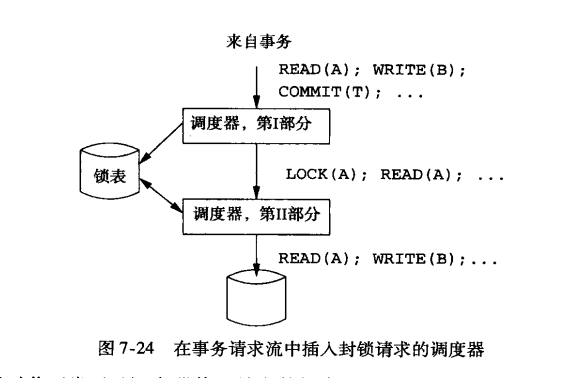
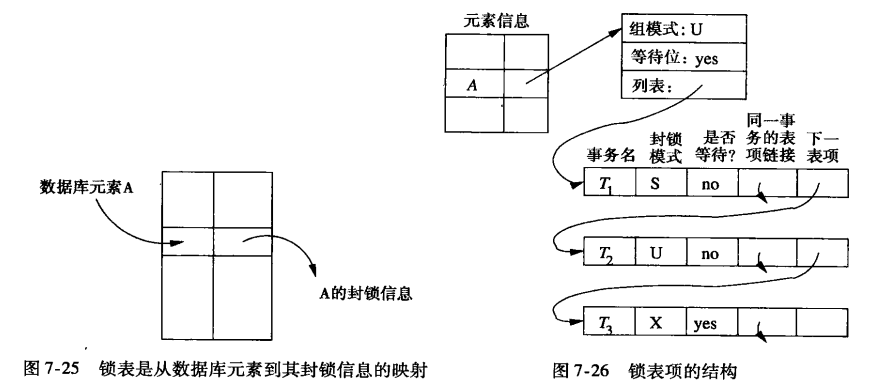

# 并发控制
## 阅读之前的问题？
1. 事务处理器应该表现出确定状态机的特质，这意味着对于相同的输入，该事务处理器总
   能最终得到相同的结果。这个问题的意义在于事务结果能够延迟写入磁盘从而获得顺序
   IO。
2. MVCC如何解决大量冲突的问题？以及重试

## 解决了什么问题？
+ 可串行性
+ 冲突可串行性

## 解决问题的手段
+ 封锁
+ 时间戳
+ 有效性确认

## 记法
$r_i(X)和w_i(X)$表示事务Ti读和写X元素， $T_i$表示具有下标i的动作序列$，事务集合T
的调度S是一个动作序列

## 冲突可串行化
**1)冲突**
+ 它们涉及统一数据库元素
+ 至少由一个是写操作

我们可以接受任一调度，进行任意非冲突的交换，目标是将该调度转换为一个串行调度。
（事务的执行顺序是可以改变的，只要执行的结果是一致的。这种也可用于减轻冲突。）

**2)冲突等价**
如果通过一系列相邻动作的非冲突交换能将它们中的一个转换为另一个，我们说两个调度是
冲突等价的。（呼应一得出的结论）

如果一个调度冲突等价于一个串行调度，那么该调度就是冲突可串行化。冲突可串行化是可
串行化的一个充分条件。它是商业系统中的调度器在需要保证可串行化是通常使用的条件。

## 优先图及可串行化判断
一个事务中包括多个操作，事务调度器对不同事务的操作进行调度。这里的优先图也是根据
这些操作的顺序画出来的。

已知调度S，其中涉及事务$T_1$和$T_2$, 可能还有其他事务，我们说$T_1$优先于$T_2$,写
作$T_1 < _sT_2$, 如果有$T_1$的动作$A_1$和$T_2$的动作$A_2$, 满足：
+ 在S中$A_1$在$A_2$之前
+ $A_1$和$A_2$都涉及同一数据库元素
+ $A_1$和$A_2$中至少有一个是写动作

优先：表达的不能交换$A_1$和$A_2$的情况。
我们可以在优先图中概括这样的先后次序。优先图的节点是调度S中的事务。

我们可以构造 S的优先图，并判断其中是否有环来判断调度S是否冲突可串行化。如果有，
那么S不是冲突可串行化。

## 基于锁的可串行化实现
**1)事务的一致性**
+ 事务只有先前以及在数据库元素上被授予了锁并且还没有释放锁时，才能读或者写该数据
  库元素。
+ 如果数据库封锁了某个数据库元素，那么它以后必须为这个元素解锁。

**2)调度的合法性**
+ 任何两个事务都不能封锁同一元素，除非其中一个事务已经先释放锁了。

**3)锁的记法**
$l_i(X)$：事务$T_i$请求数据库元素X上的锁
$u_i(X)$：事务$T_i$释放它在数据库元素X上的锁

**4)封锁调度器**
封锁将延迟执行某个事务的调度任务，直到该锁释放。

**5)两阶段锁**
+ 在每个事务中，所有封锁请求先于所有解锁请求。

## 多种锁模式的封锁系统
+ 共享锁/读锁
+ 排他锁/写锁

1. 事务的一致性。如果不是持有排他锁就不能写，并且如果不是持有某个锁就不能读
   + 读动作$r_i(X)$之前必须有$sl_i(X)$或$xl_i(X)$， 而且它们中间没有$u_i(X)$
   + 写动作$w_i(X)$之前必须有$xl_i(X)$,而且它们中间没有$u_i(X)$
2. 事务的两阶段分所。封锁必须在解锁之前。对于某个事务$T_i$中，任何$sl_i(X)$或
   $xl_i(X)$动作之前不能有$u_j(Y)$。（这里表明的意思是在某个事务中，释放锁操作不
   能在任何加锁操作之前）
3. 调度的合法性。一个元素可以被一个事务排他的封锁，或者被一个事务共享的封锁，但
   不能二者兼有。
  
### 相容性矩阵
描述锁-管理策略的简单方法。

|   | S  | X  |
|---|----|----|
| S | 是 | 否 |
| X | 否 | 否 |

### 锁的升级
将读锁升级为写锁，只能在某个元素只有一个排他锁的情况下进行升级，否则需要拒绝。

### 更新锁
用来避免一般死锁的一种方法

更新锁$ul_i(X)$只基于事务$T_i$读X而不是写X的权限。但是只有更新锁在之后升级为写锁,
读锁是不能升级的。当X上已经有共享锁的时候，我们可以授予X上的更新锁。但是一旦X上
有更新锁,就禁止X上加其他任何种类的锁。否则更新锁上可能有其他锁，导致永远无法升级
到排他锁。

|     | S   | X   | U   |
| --- | --- | --- | --- |
| S   | 是  | 否  | 是  |
| X   | 否  | 否  | 否  |
| U   | 否  | 否  | 否  |

### 增量锁 TODO (增量操作能做到原子？)
很多事务只能通过增加或减少存储的值来对数据库进行操作。
+ 增量动作一个有用的性质是这些动作相互之间是可以交换的。
+ 增量与读或者写都不能交换。

将增量作为事务中一种可能的动作引入INC(A, c)。非正式的表示为将常数c加到A上。
INC(A, c) = READ(A, t); t: = t + c; WRITE(A, t)。

与增量动作对于我们需要一个增量锁。用$il_i(X)$表示。简单的记法是$inc_i(X)$
+ 一致的事务只有在它持有X上的增量锁时才能在X上进行增量动作，但增量锁并不能赋予读
  或者写的权利。
+ 在一个合法调度中，任何时候可以有多个事务在X上持有增量锁。但是如果某个事务持有X
  上的增量锁，那么其他事务同时在X上既不能持有共享锁也不能持有排他锁。
  

## 封锁调度器的体系结构
+ 事务自身不申请锁
+ 事务不释放锁

1. 第一部分接受事务请求流，并在操作数据库前插入适当的锁动作。不管调度器使用什么
   样的封锁模式集合，调度器的第一部分必须从其中选择适当的封锁方式。
2. 第二部分接受由第一部分传来的分所和数据库访问动作序列，并正确地执行它们中的每
   一个。
3. 当事务T提交或者种植，事务管理器将通知第一部分释放T持有的所有的锁。如果有事务
   等待这些锁中的任何一个，第一部分将通知第二部分。
4. 第二部分被告知某个数据库元素X上的锁可以获得时，它决定加下来能或的X上的锁的一
   个或多个事务。获得锁的这个（或这些）事务经可能的执行，知道它们完成或到达另一
   个不能被授予的事务。
   
### 锁表
将数据库元素与该元素的封锁信息联系起来的一个关系表，可以使用散列表来实现（有没有
更好的实现呢?)

1. 组模式概括事务申请A上的一个新锁时所面临的最严苛的条件。我们并不是将封锁请求和
   同一元素上其他事务持有的锁进行比较，二是通过只比较请求与组模式来简化授权/拒绝
   决定。在共享-排他-更新（SXU）封锁模式中，规则很简单那：组模式
   + S 表示被持有的共享锁。
   + U 表示由一个更新锁，而且有可能有一个或多个共享锁
   + X 表示有一个排他锁，并且没有其他排他锁。
2. 等待位说明至少有一个事务等待A上的锁
3. 一个列表描述所有或者在A上持有锁，或者在等待A上锁的那些事务。每个列表项中的有
   用信息包括：
   + 持有锁或者等待锁的事务名
   + 该锁的方式
   + 事务是持有锁还是等待锁

**1)解锁的处理**
+ 先来先服务。同意等待时间最长的封锁请求
+ 共享锁优先。首先授予所有等待的共享锁。如果有等待的更新锁，则授予更新锁，最后才
  是排他锁。这一策略允许等待U或者X锁的事务饿死
+ 升级优先。如果一个持有U锁的事务等待将其升级到X锁，则首先授予该锁。否则采用已经
  提到的策略中的一个。
  
## 数据库元素的层次
### 多粒度的锁
为不同的应用场景选择合适的锁粒度
### 警示锁
1. 关系是最大的封锁元素
1. 每个关系由一个或多个块或者页组成，每个块或者页上存储了关系的元组。
1. 每个块包含一个或多个元组
关系 -> 块 -> 元组 (一种树状的层次结构)

增加了警示锁的相容性矩阵
|     | IS  | IX  | S   | X   |
| --- | --- | --- | --- | --- |
| IS  | 是  | 是  | 是  | 否  |
| IX  | 是  | 是  | 否  | 否  |
| S   | 是  | 否  | 是  | 否  |
| X   | 否  | 否  | 否  | 否  |

### 幻像和插入的正确处理
问题在于只能封锁已经存在的项，封锁并不存在但之后可能插入的元素没有简单的办法。

## 树协议
如果我们使用标准的诸如共享、排他和更新锁这样的封锁方式集合，并且使用两阶段封锁，
那么B树的并发使用几乎不可能的。原因在于每个事务封锁都必须从B树根节点开始（性能原
因）。此外任何插入或者删除需要重写事务的根(Page的分裂与合并)，事务需要根节点上的
一个更新锁。所以，任何时刻都只有一个非只读事务能访问B树。

因此当排除根重写的可能，我们就立即释放根上的锁，但这违背了2PL， 我们需要专门的协
议：
+ 事务的第一个锁可以在树的任何节点上。
+ 只有事务当前在父节点上持有锁才能获得后续的锁
+ 节点可以在任何时候解锁
+ 事务不能对一个它已经解锁的节点上重新上锁，即使在它该节点的父节点上仍然持有锁

## 使用时间戳的并发控制
为每个事务分配一个时间戳，需要递增，并且需要每个数据库元素X与两个时间戳以及一个
附加位联系起来:
1. RT(X), X的读时间，它是读X的事务中最高的时间戳
2. WT(X), X的写时间，它是写X的事务中最高的时间戳
3. C(X), X的提交位，当且仅当最近写X的事务已经提交， 如果读未提交的数据，可能会出
   现脏读。

静态条件导致的问题：
1. 过晚的读
2. 过晚的写

基于时间戳的调度规则:
1. 同意请求
1. 终止T（如果T违背现实）并重启具有新时间戳的T(终止再加上重启常被成为回滚)
1. 推迟T，之后决定是终止T还是同意请求。

规则：
1. 调度器收到$r_t(X)$.
   1. 如果TS(T) >= WT(X), 此读是事实上可实现的。
      1. 如果C(X)位真，同意请求。如果TS(T) > RT(X), 值RT(X) := TS(T); 否则不改变
         RT(X).
      2. 如果C(X) 为假， 推迟T知道C(X) 为真或者写X的事务中止
   2. 如果TS(T) < WT(X), 此读不可实现。回滚T，并用一个新的更大的时间戳重启它。
2. 假设调度器收到的请求$w_r(X)$
   1. 如果TS(T) >= PT(X) ,并且TS(X) >= WT(X), 此写是事实上可实现并且必须执行
      1. 为X写入新值
      2. 值WT(X) := TS(T)
      3. 值C(X) := false
   2. 如果TS(T) >= RT(X)， 但是TS(T) < WT(X), 此写是事实上可实现的，但X中已经有
      一个更晚的值。如果C(X)为真，那么前一个X上的写已经提交，我们只需要忽略T的写
      （更新）。如果C(X)位假，必须推迟T。
   3. 如果TS(T) < RT(X), 那么此写是事实上不可能实现的。T必须被回滚
3. 如果收到提交T的请求。它必须找到T缩写的所有数据库元素X，并设置C(X):=true。并让
   等待事务T的事务继续执行。
4. 中止就回滚。

